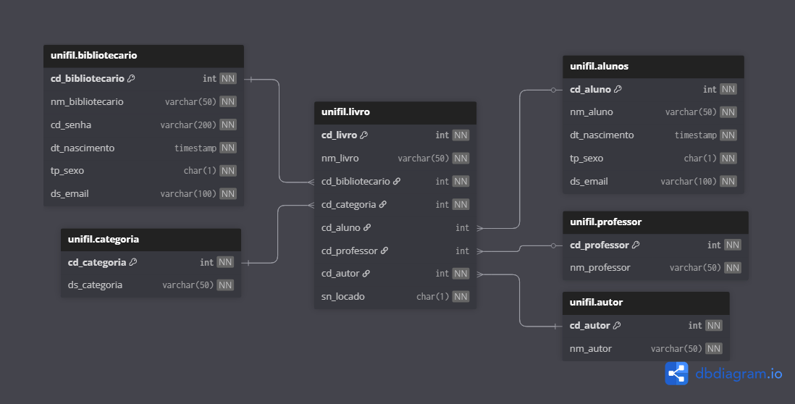

# Biblioteca 📚

```
Projeto desenvolvido utilizando o padrão MVC (Model-View-Controller), 
com o objetivo de organizar o gerenciamento de livros de uma biblioteca.
```
# Grupo:

```
 - Alexksandro Fernandes de Queiroz
 - Fernanda Tozzi Honorio
 - Gustavo Farias Ferreira
 - Murilo Choiti Fussuma
 - Samuel Souza
````

# DER:
